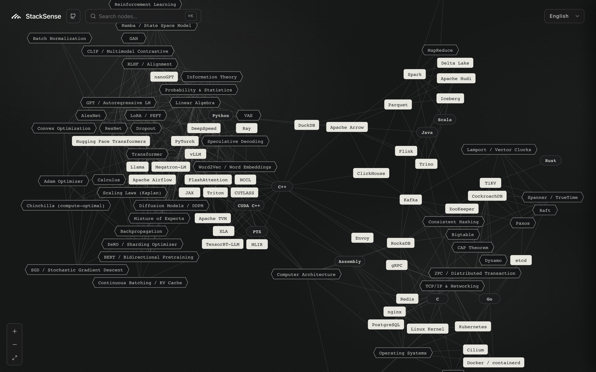

# StackSense

An interactive knowledge graph for AI / Data / Systems engineering. Every node is a concrete concept, open-source project, or programming language; every edge is a real dependency. Click a node to open a side panel with a one-line blurb, core concepts, related nodes, learning resources, and the questions you should be able to answer once you've internalized it.

Live: <https://stacksense.cc>

Corrections, missing nodes, and better blurbs are very welcome — open an issue or PR.

## License

MIT
